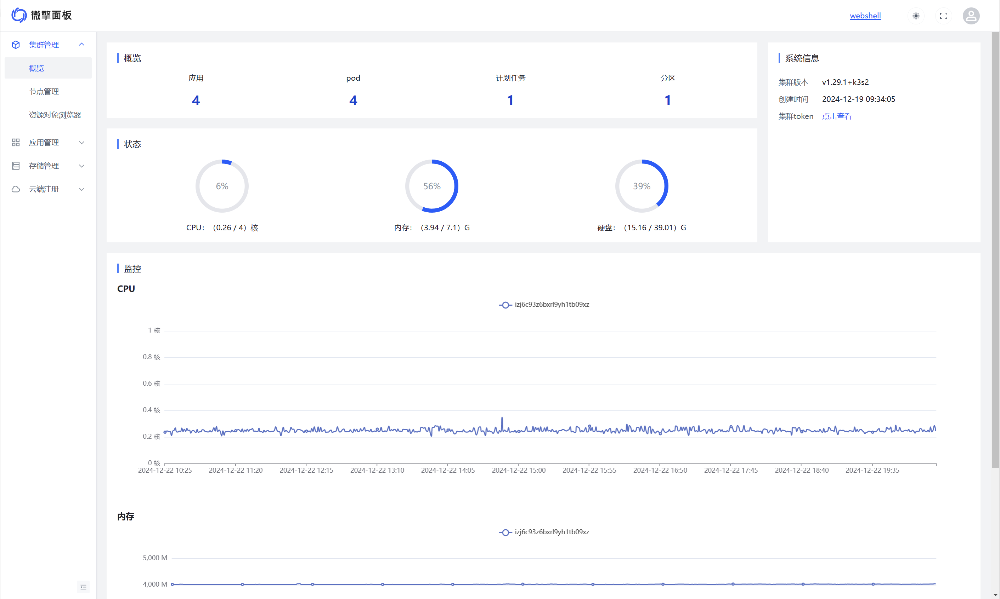
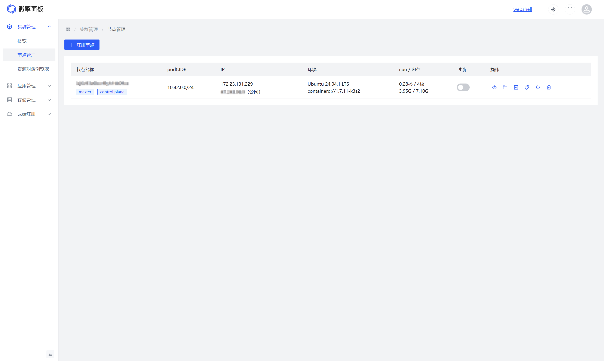
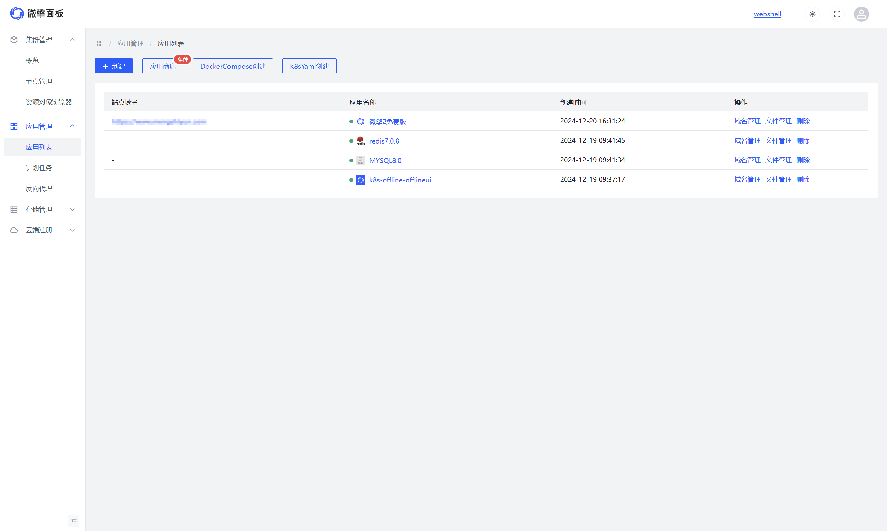
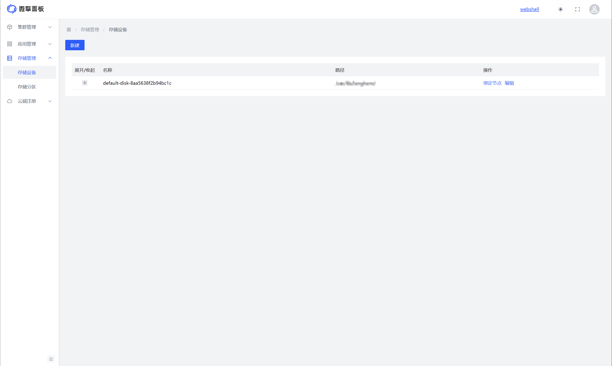
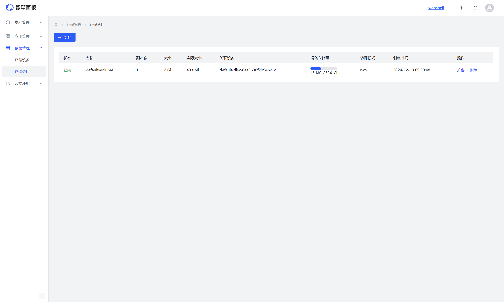

<h1 align="center">
    
    <br>
</h1>

**微擎面板（w7panel）** 一款基于Kubernetes的云原生控制面板。由微擎团队超过十年的运维经验总结而来，同时也为云原生民用化做了大量的努力，经过这几年的研发和打磨，我们推出了一款开箱即用、可民用落地的云原生服务器面板管理系统。
<br><br>

## 环境要求
- 节点服务器配置 >= 2核4G
- 支持主流 Linux 发行版本；（推荐CentOS Stream >= 9 或者 Ubuntu Server >=22）
- 须保证服务器外网端口6443、80、443、9090可访问
- 使用全新的服务器环境来安装，请勿跟其他服务器面板系统混用，以免导致环境冲突
- 浏览器要求：请使用 Chrome、FireFox、IE10+、Edge等现代浏览器；

## 安装部署
```bash
INSTALL_K3S_VERSION=v1.31.4+k3s1 sh install.sh
```
安装完成后，首次进入后台`http://{ip}:9090`，可设置管理员账号密码。

## 操作手册
- [应用管理](./docs/apps/index.md)
  - [创建应用](./docs/apps/createapp.md)
  - [应用商店](./docs/apps/createapp-appstore.md)
  - [域名管理](./docs/apps/domains.md)
  - [文件管理](./docs/apps/files.md)

## 常见问题
- 如果出网使用了NAT网关，会导致获取公网IP不正确，安装时可赋值环境变量`PUBLIC_IP`来解决，示例：
  
  ```bash
  PUBLIC_IP=123.123.123.123 sh install.sh
  ```

- 如果忘记密码，管理员可在master服务器执行命令来重置密码，`--username`传新管理员名，`--password`传新密码，示例：
  
  ```bash
  kubectl exec -it $(kubectl get pods -n default -l app=w7panel-offline | awk 'NR>1{print $1}') -- ko-app/k8s-offline auth:register --username=admin --password=123456
  ```

- 阿里云服务器可能会因为安装阿里云盾导致微擎面板启动失败，解决方案如下：
  
  1）一般云服务器，可在重做系统时勾选关闭安全加固，也可通过通过命令卸载阿里云盾。
  
  2）轻量应用服务器，可在阿里云控制台->云安全中心->功能设置->客户端，找到您的服务器后，执行卸载操作。
  
  其他问题详见阿里云官方文档：https://help.aliyun.com/zh/security-center/user-guide/uninstall-the-security-center-agent
  
- 公网IP和内网IP暂时不支持IPv6，否则可能会造成网络组件安装错误，安装前请关闭IPv6，使用IPv4。也可赋值环境变量`PUBLIC_IP`（公网IP）、`INTERNAL_IP`（内网IP）来解决，示例：
  
  ```bash
  PUBLIC_IP=123.123.123.123 INTERNAL_IP=123.123.123.123 sh install.sh
  ```
  
- 多节点集群场景下，当Server节点IP发生变更时，导致Agent节点与Server节点无法正常通信，导致部分服务启动异常时，如何排查和解决：
  
  1）首先输入命令`kubectl get node -o wide`，观察各个节点的ip和状态是否正确，如果节点处于NotReady说明节点状态异常。
  
  2）进入Agent节点服务器，找到`/etc/systemd/system/k3s-agent.service.env`文件，将`K3S_URL`中错误的Server节点IP改为正确的值，然后保存。
  
  3）执行命令`systemctl restart k3s-agent`，重启Agent节点上的k3s服务，等待几分钟后，异常服务即可恢复。

- SELinux 阻止了 /usr/lib/systemd/systemd 对 k3s 文件的执行访问，可能会导致k3s服务启动失败：
  
  启动失败会有如下提示：
  
  ```bash
  Job for k3s-agent.service failed because the control process exited with error code.
  See "systemctl status k3s-agent.service" and "journalctl -xeu k3s-agent.service" for details.
  ```
  
  如何排查确认：
  
  1）执行命令`cat /var/log/messages | grep k3s`，如果有下面这种日志，可以初步确认受SELinux策略影响：
  
  ```bash
  Mar 21 06:04:21 localhost systemd[1]: Starting Lightweight Kubernetes...
  Mar 21 06:04:21 localhost sh[35860]: + /usr/bin/systemctl is-enabled --quiet nm-cloud-setup.service
  Mar 21 06:04:21 localhost systemd[35864]: k3s-agent.service: Failed to locate executable /usr/local/bin/k3s: Permission denied
  Mar 21 06:04:21 localhost systemd[35864]: k3s-agent.service: Failed at step EXEC spawning /usr/local/bin/k3s: Permission denied
  Mar 21 06:04:21 localhost systemd[1]: k3s-agent.service: Main process exited, code=exited, status=203/EXEC
  Mar 21 06:04:21 localhost systemd[1]: k3s-agent.service: Failed with result 'exit-code'.
  Mar 21 06:04:21 localhost systemd[1]: Failed to start Lightweight Kubernetes.
  Mar 21 06:04:21 localhost setroubleshoot[10723]: SELinux is preventing /usr/lib/systemd/systemd from execute access on the file k3s. For complete SELinux messages run: sealert -l 712cf0b8-1f9f-410b-bc85-51389a867449
  Mar 21 06:04:21 localhost setroubleshoot[10723]: SELinux is preventing /usr/lib/systemd/systemd from execute access on the file k3s
  ```

  2）执行命令`setenforce 0`后重启k3s服务，如果是server节点执行`systemctl restart k3s.service`重启，如果是agent节点执行`systemctl restart k3s-agent.service`重启。

  3）如果重启成功，那么就确认受SELinux策略影响。可以通过永久关闭SELinux来解除受限：要永久禁用 SELinux，需要编辑 SELinux 的配置文件。打开`/etc/selinux/config`文件，将`SELINUX=enforcing`改为`SELINUX=disabled`。修改完成后保存文件并重启系统，这样 SELinux 就会在系统启动时被禁用。


## 核心优势
- **生产等级**
  
  由微擎团队超过十年的运维经验总结而来，已经经过微擎团队内部业务的大量部署实验，也已经过微擎用户大量的使用反馈和不断打磨，真正可用于生产级别的服务器运维管理面板。

- **简单易用**
  
  我们屏蔽了一些云原生的底层概念，以常规操作面板的思维模式重新构建了一套操作后台，用户既能享受到云原生的快速部署、高可用的性能，也能轻松上手这套系统。

- **应用生态**
  
  我们完善了k8s安装应用的逻辑，增加了依赖应用和安装配置相关的概念，以此总结出了一套应用包机制，让开发者打包应用更便利，让用户安装应用时操作门槛更低。同时系统也内置应用商店，和微擎应用市场的支持，可一键部署各类应用。

## 功能介绍
- **支持多节点**
  
  基于k8s的特性，微擎面板可同时部署到多台节点服务器上，让多个节点组合成集群服务，当流量突发时，一键扩容节点服务器、一键负载均衡，为您的业务提供高可用性能。
  
  
  
  

- **支持多种应用类型**
  
  应用支持通过docker镜像、dockerCompose、k8sYaml、k8sHelm、应用商店等多种安装方式，也支持传统应用、计划任务、反向代理等多种应用类型。
  
  

- **支持分布式存储**
  
  默认支持分布式存储功能，我们对存储管理做了大量改造，使其更符合传统用户对存储的操作逻辑。

  
  
  

- **免费HTTPS证书**
  
  默认支持免费https证书，到期前自动续签，无需人工干预。

  
  

## 社区
**微信群**


